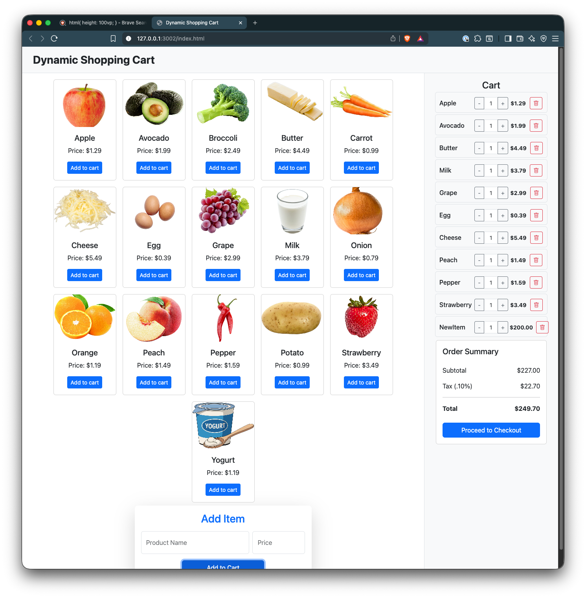
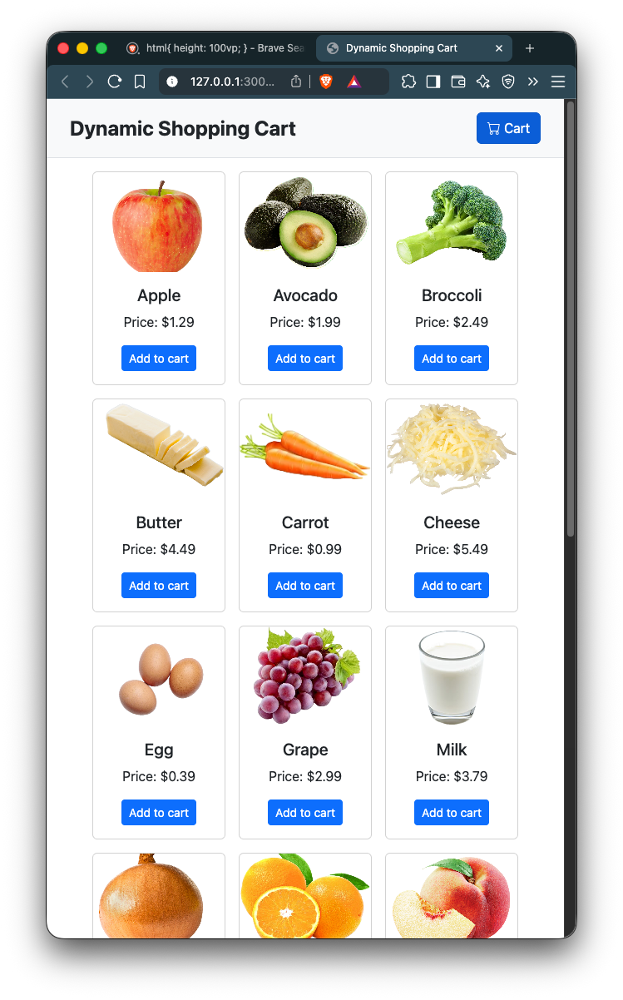
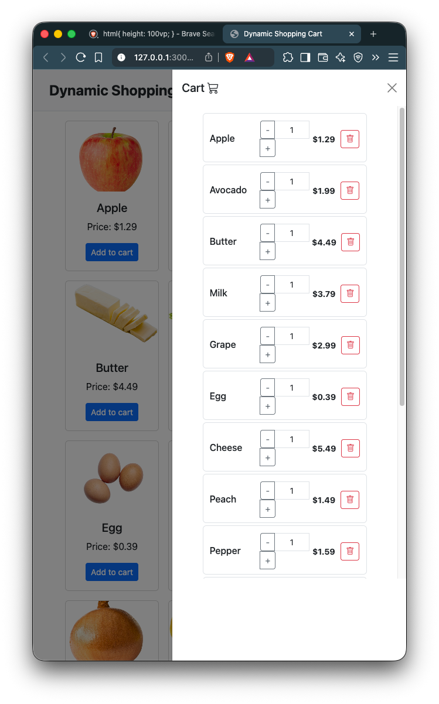

# 🛒 Dynamic Shopping Cart — DOM Manipulation Lab

## 📖 Overview

This project was developed as part of **Lab 5.1: Dynamic Content Creation**, focusing on practicing **DOM manipulation**, **event handling**, and **dynamic updates** using **JavaScript** and **Bootstrap 5**.

The application simulates the shopping cart functionality of an e-commerce website. Users can dynamically:

-   Add new products with names and prices.
-   View and manage items in the cart.
-   Increase or decrease quantities.
-   Remove individual products.
-   See automatic updates to subtotal, tax, and total in real-time.

This lab demonstrates the practical implementation of creating, appending, and updating elements dynamically through JavaScript.

---

## 🎯 Objectives

By completing this project, I was able to:

-   Dynamically create and manipulate DOM elements.
-   Implement event delegation for cart item management (`+`, `-`, and delete).
-   Update UI content in response to user interaction.
-   Maintain accurate subtotal, tax, and total price calculations.
-   Ensure responsive behavior using **Bootstrap 5** and its **offcanvas sidebar** feature.

---

## 🧩 Project Structure

```
.
├── assets
│   ├── apples.png
│   ├── avocado.png
│   ├── broccoli.png
│   ├── butter.png
│   ├── carrots.png
│   ├── cheese.png
│   ├── eggs.png
│   ├── grapes.png
│   ├── milk.png
│   ├── onion.png
│   ├── oranges.png
│   ├── peach.png
│   ├── peppers.png
│   ├── potato.png
│   ├── strawberries.png
│   ├── tomatoe.png
│   └── yogurt.png
├── index.html
├── index.js
└── style.css
```

---

## 🛠️ Technologies Used

-   **HTML5** – Structure and semantic layout
-   **CSS3 / Bootstrap 5** – Responsive design and layout utilities
-   **JavaScript (ES6)** – DOM manipulation and event handling
-   **Google Chrome DevTools** – Debugging and testing

---

## 🚀 Live Demo

> 🌐 **Live Demo:** [Click Here for Live Demo](https://structbase.github.io/Dynamic-Shopping-Cart/)

> 💻 **Repository:** [View Source on GitHub](https://github.com/structbase/Dynamic-Shopping-Cart)

---

## ⚙️ Important Details (Script Overview)

### 🧱 Core Structure

The script handles **product display**, **cart management**, and **DOM synchronization** between the **fixed sidebar cart** and **offcanvas cart** using event delegation.

---

### 🛒 1. Data & DOM References

-   **preset[]** → List of predefined store products (each with `name`, `price`, `image`).
-   **cart[]** → Tracks all items currently in the shopping cart.
-   **DOM elements**:

    -   `cardContainer` → Holds all generated product cards.
    -   `cartContainerFixed` → Fixed sidebar cart section (desktop view).
    -   `cartContainerOffcanvas` → Offcanvas cart section (mobile view).
    -   `productNameInput`, `productPriceInput`, and `addProduct` → Inputs and button for manually adding custom items.

---

### 🧩 2. Dynamic Item Generation

Each cart item is rendered using a **template literal** for consistent Bootstrap styling:

```js
function generateCartItemHTML(item) {
    return `
    <div class="row cart-item g-1 align-items-center mb-2 p-2 border rounded"
         data-name="${item.name}" 
         data-price="${item.price}">
      <div class="col-4">
        <h6 class="mb-0 text-truncate">${item.name}</h6>
      </div>

      <div class="col-4">
        <div class="input-group input-group-sm">
          <button class="btn btn-outline-secondary decrease">-</button>
          <input type="text" class="form-control text-center quantity-input px-1"
                 value="${item.quantity}" readonly />
          <button class="btn btn-outline-secondary increase">+</button>
        </div>
      </div>

      <div class="col-4 d-flex align-items-center justify-content-evenly">
        <span class="fw-bold me-2 small">$${(
            item.price * item.quantity
        ).toFixed(2)}</span>
        <button class="btn btn-sm btn-outline-danger remove">
          <i class="bi bi-trash"></i>
        </button>
      </div>
    </div>
  `;
}
```

---

### 🔁 3. Cart Rendering & Sync

`renderCart()`:

-   Regenerates HTML for every cart item using `generateCartItemHTML()`.
-   Updates **both** display areas (`cartContainerFixed` & `cartContainerOffcanvas`).
-   Calls `updateCartSummary()` to refresh subtotal, tax, and total.

---

### ➕ 4. Add to Cart Logic

```js
function addToCart(name, price) {
    const existingItem = cart.find(
        (item) => item.name === name && item.price === price
    );
    if (existingItem) {
        existingItem.quantity++;
    } else {
        cart.push({ name, price, quantity: 1 });
    }
    renderCart();
}
```

-   Prevents duplicates unless both `name` **and** `price` differ.
-   Increments quantity if the same item is added again.

---

### 👂 5. Event Delegation

Global event listeners are used to efficiently handle interactions:

-   **Product Cards:**

    -   Captures clicks on “Add to Cart” buttons dynamically rendered inside `cardContainer`.

-   **Cart Items:**

    -   Handles **Increase (+)**, **Decrease (-)**, and **Remove (🗑️)** buttons.
    -   Removes item automatically if quantity drops below 1.

This ensures all dynamic elements work without rebinding listeners every time the cart updates.

---

### 💵 6. Cart Summary Calculation

```js
function updateCartSummary() {
    const subtotal = cart.reduce(
        (sum, item) => sum + item.price * item.quantity,
        0
    );
    const tax = subtotal * 0.1; // 10% tax
    const total = subtotal + tax;

    document.getElementById("cart-subtotal").textContent = `$${subtotal.toFixed(
        2
    )}`;
    document.getElementById("cart-tax").textContent = `$${tax.toFixed(2)}`;
    document.getElementById("cart-total").textContent = `$${total.toFixed(2)}`;
}
```

Updates **subtotal**, **tax**, and **total** in real time every time the cart changes.

---

### 🧩 7. Dual Rendering Support

The cart is synced between:

-   A **fixed sidebar** for desktop users.
-   An **offcanvas sidebar** for mobile users.

Both containers are updated together for a consistent shopping experience.

---

## 🧠 Reflection Questions

### 🧩 How did you dynamically create and append new elements to the DOM?

I used JavaScript’s `createElement()` and `appendChild()` methods to build each product card and cart item. Each time the user added a new product, I constructed the HTML dynamically and injected it into the DOM.

---

### 💰 What steps did you take to ensure accurate updates to the total price?

After every cart modification, I recalculated subtotal, tax (10%), and total using array reduction. This ensured real-time updates across all UI sections desktop sidebar .

---

### 🚫 How did you handle invalid input for product name or price?

Before creating any new cart item, I validated both input fields:

-   Product name must not be empty.
-   Price must be a positive number.
-   Name(poduct) can have multiple prices.
-   Name and product the same quantity added.

If validation failed, an alert was displayed and no item was added.

---

### 🗑️ What challenges did you face when implementing the remove functionality?

The main challenge was ensuring correct updates to the totals after removal. I solved this by:

-   Using event delegation for efficient event handling.
-   Recalculating totals immediately after the item was removed.
-   Keeping both the offcanvas cart and sidebar synchronized.

---

## ⚙️ Current Issue / Location

The **offcanvas sidebar cart** is currently **not displaying added items correctly**.
Preliminary testing suggests multiple contributing issues that may be both **DOM-related** and **CSS-related**.

### 🧩 Observed Problems

1. **Cart summary not updating** inside the offcanvas cart.

    - Might require refactoring the `updateCartSummary()` function to support dual rendering for both sidebar and offcanvas.

2. **Layout and styling inconsistencies**

    - Sidebar items appear **overlapping** or **compressed**, suggesting missing Bootstrap grid constraints or lack of scrollable height.

3. **Further testing needed**

    - Full verification required once cart rendering, summary updates, and responsive behavior are stabilized.

---
## 📸 Screenshots

### 🖥️ Desktop Layout



### 📱 Mobile Layout



